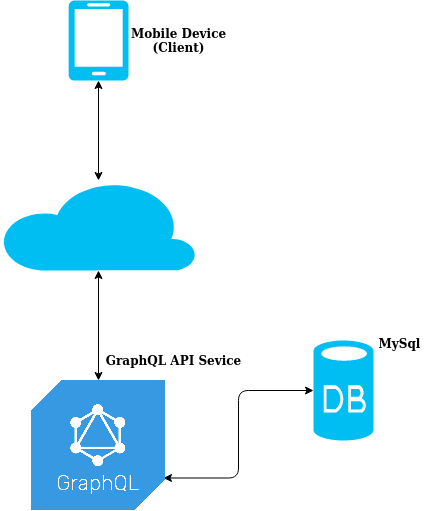

Overview
=======================
An API service that allows ingesting, 

Architecture
------------
The diagram below shows that the client side (mobile device) gets the data through the GraphQL service where it gets the data from a db (MySQL in our case). This diagram shows the components from very abstract level.

Installation
---------------
 run the following command to install dependencies:

    > cd {Project-Directory}
    > yarn

Transpilation
---------------------
The code is written in type script. Run the following commands to transpile it:

    > cd {Project Directory}
    > yarn build

Project Structure
-----------------
    /src
      /Container     # Includes implementation of inversify (for dependency injection).
      /DTO           # Includes interfaces used in the code.
      /Repositories  # Includes services that fetch/add travel logs from data sources.
      /Resolvers     # Typescript implementation for GraphQL resolvers.
      /Schemas       # Typescript implementation for GraphQL schemas.
      /Utils         # Some utilities used to facilitate the implementation.
    /tests           # Unit tests.
    /dev-db          # incudes docker-compose and db dump files for creating a db for development purposes. 
    /features        # Features in BDD style.
    /steps           # BDD features implementation.

Environment Variables
---------------------
You can set the environment variables used by the service in .env file, the file includes the following:
  - MYSQL_HOST: The db host address.
  - MYSQL_DB_NAME: The db name.
  - MYSQL_USER: The db user name.
  - MYSQL_PWD: The db user password.
  - MYSQL_PORT: The db port.
  - DATA_SOURCE: This indicates the type of data source (e.g. MYSQL, DynamoDB), If you do not have any db,
                 leave it empty and a fake data source will be used.
  - LOG_LEVEL: This min log level set with the logger
  - MONITORING_ENABLED: This variable should be set to either 'Y' or 'N', it idicates whether to
                        switch on monitoring for GraphQL resolvers (logging calling the resolvers with
                        arguments passed and response). The monitoring service has been implemented using
                        AOP (Aspect oriented programming) paradigm (Read more about AOP at 
                        https://www.npmjs.com/package/kaop-ts#resources ).
  - SERVICE_URL: This variable is used only with E2E test.

Running the service locally
---------------------------
Before running the server, you need to create a db locally. A docker composer file is included in this repo that 
allows you to run a MYSQL db locally, you need to run the following:

    > cd {Project Directory}/dev-db
    > docker-compose up -d
    > cat ./db_dump.sql | docker-compose exec -T captain-celebrities-db mysql -uroot -prootPWD@2020! captain-celebrities

The last command imports the db schema and populates the db with some records.

The next step is to start the service:

    > cd {Project Directory}
    > yarn start

Once it is running, you can then use the GraphQL playground on your browser to test the service.

Unit Testing
---------------------
To run the unit tests and generate the coverage document (the document will be generated at {Project Directory}/document), you need to run the following commands:

    > cd {Project Directory}
    > yarn test:coverage

The coverage document will be generated at {Project Directory}/coverage. It includes details about how the unit tests covered the code showing lines covered and not covered by the unit tests.

E2E Tests
----------
The purpose of this test is to test the full life cycle of an arrival log (in our case, ingest then list). This has been implemented using cucumber framework.

To run this test, you need to get the service running then set SERVICE_URL in the .env file, and finally run the following:

    > cd {Project Directory}
    > yarn test:e2e

Examples
--------
- You can get all travel logs by using the following query:

  query{
    allTravelLogs{
      captainName,
      vesselName,
      arrivalDate,
      port,
    }
  }

- You can get logs by a captain name using like the following query:

  query{ 
    travelLogsByCaptainName(cptainName: "james"){
      captainName,
      vesselName,
      arrivalDate,
      port,
    }
  }

- You can ingest a travel log as follow:

  mutation {
    addTravelLog(
      captainName: "Captain_1", 
      vesselName: "Vessel_1", 
      arrivalDate: "2019-01-03", 
      port: "11"
    ) {
      captainName
    }
  }

Demo
-----
The service has been deployed using Azure App Service and the GraphQL playground can be used at the following URL:
https://travellogsapi.azurewebsites.net/

Assumptions
-----------
This service is a prototype so it lacks the following:

  - Implementing an authentication mechanism.
  - DB Credential should be securely stored in a tool like AWS/Azure VAULT and not in the env file.
  - Pagination when getting logs.
